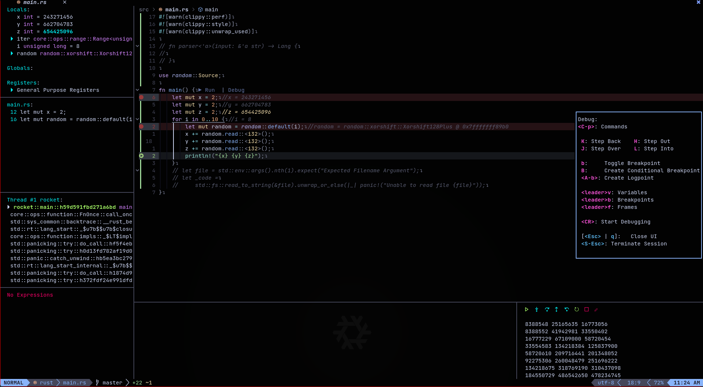

<!--toc:start-->
- [Dependencies](#dependencies)
  - [Required](#required)
  - [Optional](#optional)
    - [General usage](#general-usage)
    - [Haskell](#haskell)
    - [Rust](#rust)
    - [C++](#c)
    - [Cmake](#cmake)
    - [Fennel](#fennel)
    - [Lua](#lua)
    - [Nix](#nix)
    - [Python](#python)
    - [Markdown](#markdown)
    - [Shell](#shell)
    - [Misc](#misc)
- [Some Bugs](#some-bugs)
- [Modules](#modules)
<!--toc:end-->

## Dependencies

### Required

- A font supporting [nerd-font](https://www.nerdfonts.com/) icons
- [npm](https://www.npmjs.com/)
- [fennel](https://fennel-lang.org/)
- [git](https://git-scm.com/)
- [gcc](https://gcc.gnu.org/)
- xmodmap

### Optional

#### General usage
- [fontconfig](https://www.freedesktop.org/wiki/Software/fontconfig/)
- [python (3.7+)](https://www.python.org/)
- [ripgrep](https://github.com/BurntSushi/ripgrep)
- [wakatime](https://wakatime.com)
- [btop](https://github.com/aristocratos/btop)
- A valid Codium auth
- [JetBrainsMono Nerd Font](https://www.nerdfonts.com/font-downloads)

#### Haskell

- [haskell-language-server](https://github.com/haskell/haskell-language-server)
- [brittany](https://hackage.haskell.org/package/brittany)
- [cabal-fmt](https://hackage.haskell.org/package/cabal-fmt)

#### Rust

- [rust-analyzer](https://rust-analyzer.github.io/)
- [clippy](https://github.com/rust-lang/rust-clippy)
- [nextest](https://github.com/nextest-rs/nextest)
- [evcxr](https://github.com/google/evcxr)
- [lldb](https://lldb.llvm.org/)

#### C++

- [cmake-format](https://github.com/cheshirekow/cmake_format)
- [cppcheck](https://cppcheck.sourceforge.io/)
- [clangd](https://clangd.llvm.org/)

#### Cmake
- [cmake-language-server](https://github.com/regen100/cmake-language-server)

#### Lua

- [sumneko_lua](https://github.com/sumneko/lua-language-server/wiki)
- [stylua](https://github.com/johnnymorganz/stylua)

#### Nix

- [nixfmt](https://hackage.haskell.org/package/nixfmt)
- [statix](https://github.com/nerdypepper/statix)
- [deadnix](https://github.com/astro/deadnix)
- [nil](https://github.com/oxalica/nil)

#### Python

- [pylint](https://pylint.pycqa.org/en/latest/)
- [black](https://github.com/psf/black)
- [pytest](https://docs.pytest.org/en/7.2.x/)

#### Markdown

- [marksman](https://github.com/artempyanykh/marksman) - Markdown language server
- [prettier](https://prettier.io/) - Markdown Formatter

#### Shell

- [shellcheck](https://hackage.haskell.org/package/ShellCheck)
- [beautysh](https://github.com/lovesegfault/beautysh)

#### Misc

- [cspell](https://github.com/streetsidesoftware/cspell) - Spellchecker
- [jq](https://github.com/stedolan/jq) - Json processor
